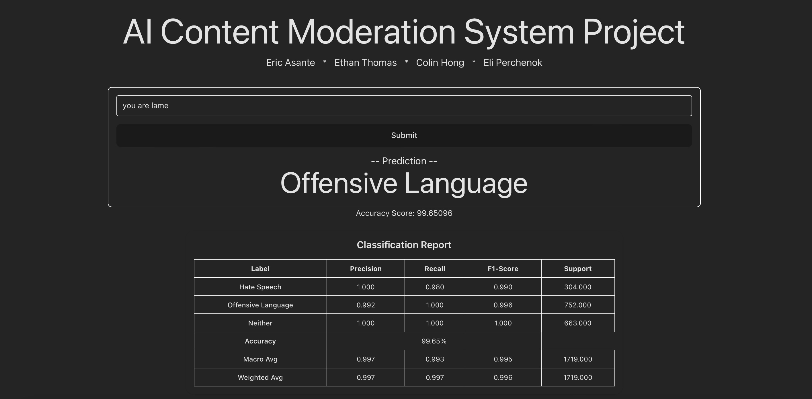
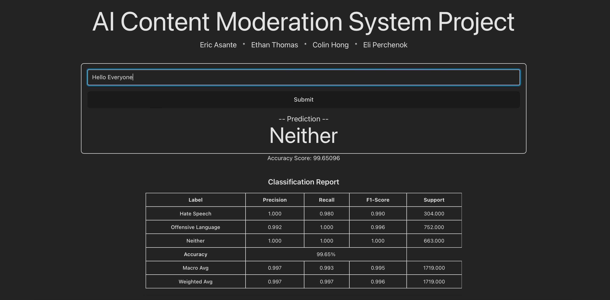
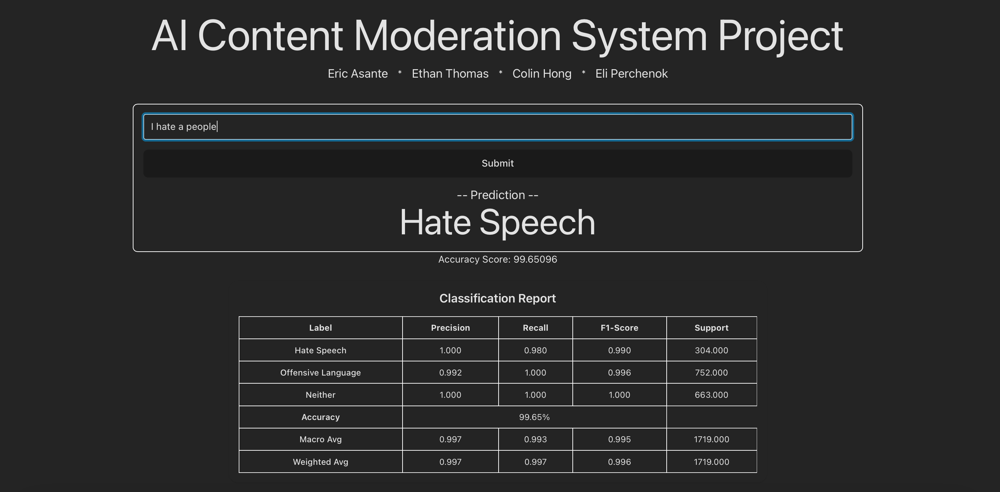

# AI Content Moderation System Project
| Offensive Language Perdiction | Neither Perdiction | Hate Speech Perdiction |
|--------------|--------------|--------------|
|  |  |  |

An AI-powered web application that classifies user-generated text into three categories: **Hate Speech**, **Offensive Language**, or **Neither**. Built to demonstrate the capabilities of an application using machine learning in real-time content moderation.

## 👨‍💻 Developers

- Eric Asante  
- Ethan Thomas  
- Colin Hong  
- Eli Perchenok  

## 🧠 How It Works

The system takes in user-inputted text, processes it using a trained machine learning classifier, and displays the predicted category. It also shows an accuracy score and a detailed classification report including:

- Precision
- Recall
- F1-Score
- Accuracy

## 🐳 Local Setup Using Docker

To run the full stack locally using Docker:

1. **Build the Docker image**

docker build -f Dockerfile -t app .

2. **Run application**

docker run -p 5173:5173 -p 5123:5123 app

